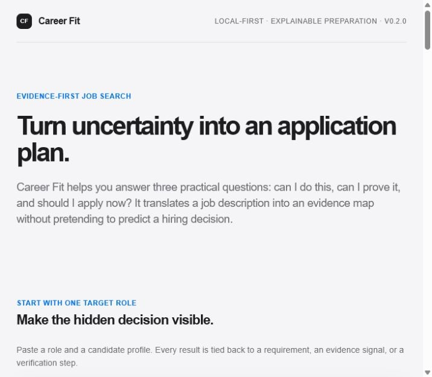
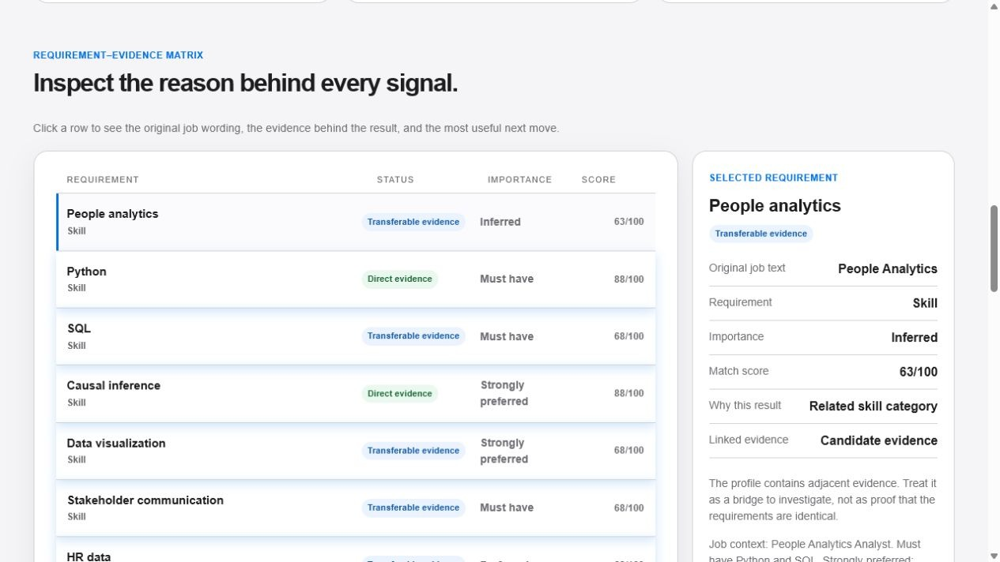

# Career Fit

**Career Fit** is an explainable, evidence-first job-search planner for job seekers, career coaches, and labor-market researchers.

It answers three questions that keyword tools usually collapse into one:

> Can I do this? Can I prove it? Should I apply now?

Career Fit translates one job description and one candidate profile into a requirement–evidence map. It distinguishes direct evidence, transferable evidence, proof gaps, foundation gaps, and hard application gates. It then turns the most important gaps into concrete proof or verification actions.

Career Fit is not an ATS score, a hiring-probability model, an employer ranking system, or a judgment of personal value.

## Why this product exists

Job seekers face different problems that look identical to a keyword checker:

- A career switcher may have adjacent experience but no employer-facing translation.
- A PhD or nontraditional candidate may have strong research capability but weak industry proof.
- A mid-career applicant may be ready on skills but blocked by an unresolved work-authorization, license, degree, or experience requirement.
- Anyone can have a proof gap: the capability exists, but the resume does not make it reviewable.

Career Fit keeps these cases separate so a user leaves with a better next move rather than a discouraging binary label.

## What it does

Given a job description and a candidate profile, the v0.3 product:

1. extracts dictionary-backed skill requirements and explicit hard gates;
2. detects conservative local negation so statements such as “no direct HR-data experience” are not counted as positive evidence;
3. maps candidate statements to auditable evidence objects;
4. distinguishes direct evidence, thin proof, transferable evidence, and missing evidence;
5. calculates Evidence Fit, Capability Signal, Proof Signal, Application Readiness, and Information Confidence;
6. ranks proof, translation, bridge, foundation, and verification gaps;
7. proposes an expected proof artifact and an evidence prompt for each priority action.

It can also compare two or three target roles against the same candidate profile. The comparison ranks preparation priority using the existing readiness, evidence-fit, and information-confidence signals, then lets the user inspect any role in the full requirement matrix.

## Quick start

```powershell
python -m venv .venv
.\.venv\Scripts\Activate.ps1
python -m pip install -e .

# Analyze one role locally
career-fit analyze --job-file examples\single_job\people_analytics_job.txt --candidate-file examples\single_job\candidate_profile.txt --evidence-file examples\single_job\evidence.json

# Compare a small target-role portfolio
career-fit compare --roles-file examples\role_portfolio.json --candidate-file examples\single_job\candidate_profile.txt

# Launch the visual explorer
career-fit serve
# Open http://127.0.0.1:8766
```

If the console script is not on PATH, use `python -m career_fit.cli` for the same commands. The legacy `skillbundle` namespace and console script remain available as a compatibility layer.

### Optional semantic review

The explorer can send the supplied job text, candidate text, and deterministic requirement map to an OpenAI-compatible chat-completions endpoint for a second, text-based review. The review is advisory: it cannot change the rule-based scores, requirement classifications, or application decision. Leave the variables unset to keep the explorer fully local and rule-based.

```powershell
$env:CAREER_FIT_LLM_API_KEY = "your-key"
$env:CAREER_FIT_LLM_BASE_URL = "https://api.openai.com/v1"
$env:CAREER_FIT_LLM_MODEL = "your-model"
career-fit serve
```

Candidate text is sent only when the review button is used. A local OpenAI-compatible endpoint may be used without an API key.

## Visual explorer

The local page is designed to feel useful to a first-time job seeker while keeping the labor-economics logic visible:

- three animated signal rings separate capability, proof, and application readiness;
- the scorecard shows Evidence Fit, Application Readiness, Information Confidence, and unresolved Hard Gates;
- the requirement–evidence matrix makes every assessment inspectable;
- the profile chart shows the shape of evidence overlap across requirements;
- action cards identify a time horizon, effort estimate, expected proof artifact, and evidence prompt;
- plain-language interpretation cards explain what the metrics can and cannot mean.





## Interpreting the scores

For each soft requirement `j`, the engine reports:

```text
Match_j = 0.35 coverage
         + 0.25 evidence strength
         + 0.20 proficiency signal
         + 0.10 recency
         + 0.10 evidence depth
```

**Evidence Fit** is the importance-weighted average of these matches, rescaled to 0–100. Must-have, strongly preferred, preferred, and inferred requirements receive weights 1.0, 0.7, 0.4, and 0.2.

**Capability Signal** gives descriptive weight to direct, thin, and transferable overlap. Transferable evidence is intentionally discounted and never presented as equivalent proof.

**Proof Signal** summarizes how concrete and reviewable the supplied evidence is. Structured work, research, portfolio, duration, and measurable-result fields are stronger than a bare keyword mention.

**Application Readiness** is a preparation-triage measure:

```text
Readiness = 100 × (0.50 must-have match
                  + 0.30 proof signal
                  + 0.20 hard-gate signal)
```

An unresolved hard gate can produce a `verify_before_applying` status even when Evidence Fit is high. None of these measures is a hiring probability or a causal estimate.

The single-role machine-readable output uses schema `career_fit.v0.2`; role comparison uses `career_fit.compare.v0.1`. Details are in [docs/data-contract.md](docs/data-contract.md). The scoring choices are documented in [docs/methodology.md](docs/methodology.md).

## Data and taxonomy

The demo uses a versioned English dictionary with a transparent seed layer and an O*NET 30.3 enrichment layer. The current local build exposes 421 entries: Essential Skills, Transferable Skills, Knowledge elements, and Software Skills marked Hot Technology or In Demand. Exact matching is conservative: ambiguous software names require nearby software context, while bare common-word aliases are excluded. It is a transparent baseline for evidence extraction, not a complete occupational ontology.

- `config/seed_dictionary_en.json` stores canonical skill IDs, aliases, and analytical category codes.
- `config/onet_enrichment_en.json` stores O*NET-derived labels, source element IDs, exact-label mapping methods, and the 10-category analytical mapping.
- `config/taxonomy_10_ai.json` stores the ten-category research layer and 45 pair combinations.
- `tools/build_onet_enrichment.py` regenerates the enrichment layer from the registered O*NET 30.3 text release.
- `config/source_registry.json` records public sources and redistribution notes for ESCO, O*NET, and SkillSpan.
- `src/skillbundle/career.py` stores explicit transfer crosswalks and evidence rules.

Raw third-party data is not silently bundled. Check each source’s current license and attribution requirements before redistribution.

## Privacy and fairness

The demo runs locally. Candidate text and structured evidence are sent only to the local Python process serving the page; this repository does not include a hosted personal-data service.

Career Fit should help a person prepare, not automate exclusion. A missing mention is not proof of missing ability. The engine excludes conservatively detected negative statements, exposes uncertainty, avoids protected traits, and keeps hard constraints visible for human verification. See [docs/privacy-and-fairness.md](docs/privacy-and-fairness.md).

## Repository layout

```text
src/career_fit/       public Career Fit namespace and CLI
src/skillbundle/      compatibility namespace and transparent engine
config/               English seed dictionary, taxonomy, and source registry
examples/             reproducible job, candidate, and evidence inputs
docs/                 product, design, methodology, and data contracts
tests/                extraction, negation, constraints, and fit tests
```

## Roadmap

- expand the reviewed multilingual skill dictionary and occupational crosswalks;
- add resume-to-evidence import with explicit user confirmation;
- support multiple target roles and career pathways while preserving each audit trail;
- add calibrated validation only if an appropriate, consented outcome dataset becomes available;
- publish sensitivity checks for taxonomy, importance weights, transfer rules, and missing-evidence assumptions.

## License

MIT. See [LICENSE](LICENSE).
